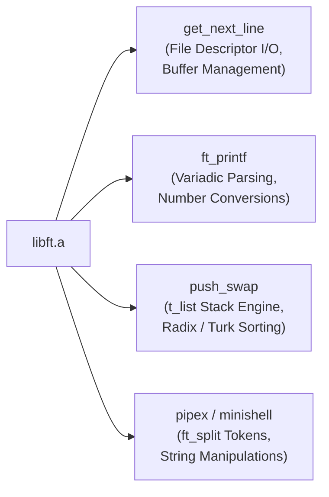

<div align="center">

# Libft
### *Building a Robust C Standard Library from First Principles*

[](https://42.fr)
[](https://en.wikipedia.org/wiki/C_(programming_language))
[-orange?style=for-the-badge&logo=librarything&logoColor=white)]()
[-success?style=for-the-badge&logo=gnu-make&logoColor=white)]()

<p align="center">
  <b>A comprehensive, production-grade recreation of standard C library functions, memory allocators, byte-level primitives, string manipulation utilities, and dynamic data structures.</b>
</p>

---

</div>

## 📑 Table of Contents
1. [Core Philosophy & Educational Motivation](#-core-philosophy--educational-motivation)
2. [Project Architecture & Compilation Model](#-project-architecture--compilation-model)
3. [Why Rebuild Libc? Contract vs. Undefined Behavior](#-why-rebuild-libc-contract-vs-undefined-behavior)
4. [Complete Function Catalog](#-complete-function-catalog)
5. [In-Depth Technical Deep Dives](#-in-depth-technical-deep-dives)
   - [Memory Primitives: `ft_memcpy` vs. `ft_memmove`](#1-memory-primitives-ft_memcpy-vs-ft_memmove)
   - [Dynamic Allocation: `ft_calloc` & Zero Initialization](#2-dynamic-allocation-ft_calloc--zero-initialization)
   - [Multi-Tier Allocation: `ft_split` & Atomic Rollback](#3-multi-tier-allocation-ft_split--atomic-rollback)
   - [Two's Complement Edge Cases: `ft_itoa` & `ft_putnbr_fd`](#4-twos-complement-edge-cases-ft_itoa--ft_putnbr_fd)
   - [Accumulator Overflow: `ft_atoi` vs. `ft_3atwa`](#5-accumulator-overflow-ft_atoi-vs-ft_3atwa)
   - [Callback Mechanics: `ft_strmapi` & `ft_striteri`](#6-callback-mechanics-ft_strmapi--ft_striteri)
6. [Memory Management & Ownership Model](#-memory-management--ownership-model)
7. [Pointer Fundamentals & Byte-Level Mechanics](#-pointer-fundamentals--byte-level-mechanics)
8. [String Semantics in C](#-string-semantics-in-c)
9. [Const Correctness & API Design](#-const-correctness--api-design)
10. [Linked List Architecture (Bonus API)](#-linked-list-architecture-bonus-api)
11. [Algorithmic Complexity & Memory Overhead](#-algorithmic-complexity--memory-overhead)
12. [Makefile Mechanics & Static Archiving](#-makefile-mechanics--static-archiving)
13. [Static Libraries & Linking Workflow](#-static-libraries--linking-workflow)
14. [Repository Structure](#-repository-structure)
15. [Build, Installation & Usage](#-build-installation--usage)
16. [Verification, Edge Cases & Testing Strategy](#-verification-edge-cases--testing-strategy)
17. [Debugging & Memory Analysis](#-debugging--memory-analysis)
18. [42 Norminette & Implementation Constraints](#-42-norminette--implementation-constraints)
19. [How Libft Powers Downstream 42 Projects](#-how-libft-powers-downstream-42-projects)
20. [Viva & Peer Evaluation Preparation](#-viva--peer-evaluation-preparation)
21. [Common Pitfalls & Architectural Lessons Learned](#-common-pitfalls--architectural-lessons-learned)

---

## 🧠 Core Philosophy & Educational Motivation

At higher levels of abstraction, modern languages manage memory, string concatenation, dynamic arrays, and type polymorphism through automated runtimes and garbage collectors. **Libft strips away these safety nets to rebuild C standard abstractions from raw bytes.**

```
┌────────────────────────────────────────────────────────┐
│                   Using an Abstraction                 │
│              (Calling malloc(), printf(), strcpy())     │
└───────────────────────────┬────────────────────────────┘
                            │
                            ▼
┌────────────────────────────────────────────────────────┐
│                Understanding an Abstraction            │
│         (Tracking stack vs heap, pointer arithmetic)   │
└───────────────────────────┬────────────────────────────┘
                            │
                            ▼
┌────────────────────────────────────────────────────────┐
│               Rebuilding the Abstraction               │
│          (Handling NULL pointers, buffer bounds, ar)   │
└───────────────────────────┬────────────────────────────┘
                            │
                            ▼
┌────────────────────────────────────────────────────────┐
│             Mastering Edge Cases & Failure             │
│   (Two's complement INT_MIN, overlap, malloc rollback) │
└────────────────────────────────────────────────────────┘
```

Implementing standard library functions from scratch forces an engineer to master:
- **Memory as a continuous linear address space**: Understanding that all data structures—strings, integers, structs, arrays—are merely patterned layouts of 8-bit bytes (`unsigned char`).
- **Pointer Arithmetic & Aliasing**: Calculating byte offsets, pointer offsets, and the dangers of pointer casting.
- **Resource Ownership & Lifecycle**: Defining explicit allocation boundaries, preventing memory leaks, and establishing robust rollback mechanisms when allocations fail mid-operation.
- **Compilation & Linkage Pipeline**: Transitioning from human-readable C source (`.c`) to relocatable machine code (`.o`), static archives (`.a`), and final linked executables.

---

## 🏗 Project Architecture & Compilation Model

The project is architected as an extensible C static library (`libft.a`) built entirely via a strict POSIX-compliant `Makefile`.

```mermaid
flowchart TD
    subgraph Sources ["Source Code (.c)"]
        A1["ft_is*.c / ft_to*.c\n(Classification)"]
        A2["ft_str*.c\n(String Utilities)"]
        A3["ft_mem*.c / ft_bzero.c\n(Raw Memory)"]
        A4["ft_split.c / ft_itoa.c\n(Allocating Routines)"]
        A5["ft_put*_fd.c\n(I/O System Calls)"]
        A6["ft_lst*_bonus.c\n(Node / List Engine)"]
    end

    subgraph Header ["Header Contract"]
        H1["libft.h\n• Function Prototypes\n• t_list struct definition\n• System includes (<unistd.h>, <stdlib.h>)"]
    end

    subgraph Compilation ["Compilation Stage (cc)"]
        C1["cc -Wall -Wextra -Werror -c"]
    end

    subgraph Objects ["Relocatable Machine Code (.o)"]
        O1["ft_*.o\n(Mandatory Object Files)"]
        O2["ft_lst*_bonus.o\n(Bonus Object Files)"]
    end

    subgraph Archiving ["Archiving Stage (ar)"]
        AR["ar rcs libft.a"]
    end

    subgraph Output ["Static Archive"]
        LIB["libft.a\n(Indexed Binary Library)"]
    end

    subgraph Consumers ["Downstream 42 Projects"]
        P1["ft_printf"]
        P2["get_next_line"]
        P3["push_swap"]
        P4["pipex / minishell"]
    end

    Sources -->|Includes| H1
    Sources -->|Compiled by| C1
    H1 -->|Defines Types & Signatures| C1
    C1 -->|Produces| Objects
    Objects -->|Bundled by| AR
    AR -->|Generates| LIB
    LIB -->|Linked at compile time (-lft)| Consumers
```

### The Three-Phase Build Pipeline
1. **Preprocessing & Compilation (`cc -c`)**:
   - Each `.c` file is independently compiled with `-Wall -Wextra -Werror` into a relocatable ELF/Mach-O object file (`.o`).
   - The compiler verifies type safety, symbol declarations against [libft.h](file:///Users/mac/Desktop/libft/libft.h), and const qualifiers.
2. **Static Archiving (`ar rcs`)**:
   - The `ar` (archiver) tool packages individual `.o` files into a unified static archive `libft.a`.
   - The `s` flag generates and updates the object symbol index (equivalent to running `ranlib`), ensuring the linker can resolve function addresses in $O(1)$ symbol lookups.
3. **Downstream Static Linkage**:
   - When a user compiles `cc main.c -L. -lft`, the static linker (`ld`) resolves only the necessary object code referenced by `main.c` from `libft.a` and burns it directly into the binary's text segment.

---

## ⚖️ Why Rebuild Libc? Contract vs. Undefined Behavior

Standard C library functions operate under strict POSIX/ISO C specifications. Recreating them requires understanding exact interface contracts:

| Concept | Standard C Libc Expectation | Libft Implementation Strategy |
| :--- | :--- | :--- |
| **Null Pointer Handling** | Passing `NULL` to `strlen`, `strcpy`, or `memcpy` produces **Undefined Behavior (UB)** or `SIGSEGV`. | Strictly follows standard specifications while adding defensive guards where specified by 42 (e.g. `ft_split`, `ft_strjoin`, `ft_memmove` check for `NULL`). |
| **Byte vs Char Comparison** | Memory functions (`memcmp`, `memchr`) compare bytes as **`unsigned char`**. | Explicitly casts all raw memory pointers to `unsigned char *` to avoid signed integer extension bugs with values $> 127$. |
| **Buffer Overflows** | Unbounded functions (`strcpy`, `strcat`) are dangerous and deprecated. | Adopts BSD size-bounded primitives (`ft_strlcpy`, `ft_strlcat`) that guarantee NUL-termination whenever buffer capacity $> 0$. |
| **Memory Allocation Failures** | Dynamic allocators must gracefully handle heap exhaustion. | All allocating functions check for `NULL` returns from `malloc` and execute explicit cleanup paths without leaking previously allocated blocks. |

---

## 📚 Complete Function Catalog

The library is organized into specialized functional modules. Every function documented below is verified to exist directly within the repository.

### 1. Character Classification & Conversion (`ctype`)
*Pure, deterministic character introspection and ASCII transformations.*

| Function | Prototype | Description | Key Concept |
| :--- | :--- | :--- | :--- |
| [`ft_isalpha`](file:///Users/mac/Desktop/libft/ft_isalpha.c) | `int ft_isalpha(int c);` | Checks if `c` is an alphabetical ASCII character (`'A'-'Z'` or `'a'-'z'`). | ASCII range validation |
| [`ft_isdigit`](file:///Users/mac/Desktop/libft/ft_isdigit.c) | `int ft_isdigit(int c);` | Checks if `c` is a decimal digit (`'0'-'9'`). | ASCII range validation |
| [`ft_isalnum`](file:///Users/mac/Desktop/libft/ft_isalnum.c) | `int ft_isalnum(int c);` | Checks if `c` is alphanumeric (composed of `ft_isalpha` or `ft_isdigit`). | Function composition |
| [`ft_isascii`](file:///Users/mac/Desktop/libft/ft_isascii.c) | `int ft_isascii(int c);` | Checks if `c` fits into the standard 7-bit ASCII table (`0` to `127`). | Bit boundary bounds check |
| [`ft_isprint`](file:///Users/mac/Desktop/libft/ft_isprint.c) | `int ft_isprint(int c);` | Checks if `c` is any printable character including space (`32` to `126`). | ASCII table boundaries |
| [`ft_isspace`](file:///Users/mac/Desktop/libft/ft_isspace.c) | `int ft_isspace(char c);` | Validates standard POSIX whitespace characters (`' '`, `'\t'`, `'\n'`, `'\r'`, `'\f'`, `'\v'`). *Returns 0 if space, 1 if not.* | Custom helper routine |
| [`ft_toupper`](file:///Users/mac/Desktop/libft/ft_toupper.c) | `int ft_toupper(int c);` | Converts a lowercase ASCII letter to uppercase by subtracting `32`. | ASCII bit translation |
| [`ft_tolower`](file:///Users/mac/Desktop/libft/ft_tolower.c) | `int ft_tolower(int c);` | Converts an uppercase ASCII letter to lowercase by adding `32`. | ASCII bit translation |

---

### 2. Raw Memory Manipulation (`string.h`)
*Byte-level operations on arbitrary blocks of untyped memory using `void *` and `unsigned char *`.*

| Function | Prototype | Description | Key Concept |
| :--- | :--- | :--- | :--- |
| [`ft_memset`](file:///Users/mac/Desktop/libft/ft_memset.c) | `void *ft_memset(void *s, int c, size_t n);` | Fills the first `n` bytes of memory area `s` with constant byte `c`. | Byte-level assignment |
| [`ft_bzero`](file:///Users/mac/Desktop/libft/ft_bzero.c) | `void ft_bzero(void *s, size_t n);` | Erases `n` bytes of memory starting at `s` by writing zero bytes (`\0`). | Memory zeroing via `memset` pattern |
| [`ft_memcpy`](file:///Users/mac/Desktop/libft/ft_memcpy.c) | `void *ft_memcpy(void *dest, const void *src, size_t n);` | Copies `n` bytes from `src` to `dest`. Memory areas **must not overlap**. | Fast forward memory copy |
| [`ft_memmove`](file:///Users/mac/Desktop/libft/ft_memmove.c) | `void *ft_memmove(void *dest, const void *src, size_t n);` | Copies `n` bytes between memory areas, safely handling overlapping buffers. | Overlap detection & reverse copy |
| [`ft_memchr`](file:///Users/mac/Desktop/libft/ft_memchr.c) | `void *ft_memchr(const void *s, int c, size_t n);` | Scans initial `n` bytes of `s` for first instance of `(unsigned char)c`. | Linear byte search |
| [`ft_memcmp`](file:///Users/mac/Desktop/libft/ft_memcmp.c) | `int ft_memcmp(const void *s1, const void *s2, size_t n);` | Compares first `n` bytes of `s1` and `s2` as `unsigned char`. | Lexicographical byte comparison |

---

### 3. String Inspection & Search (`string.h`)
*Calculations and search algorithms for null-terminated strings.*

| Function | Prototype | Description | Key Concept |
| :--- | :--- | :--- | :--- |
| [`ft_strlen`](file:///Users/mac/Desktop/libft/ft_strlen.c) | `size_t ft_strlen(const char *s);` | Computes the length of string `s` up to, but not including, the terminating `\0`. | Linear scan $O(n)$ |
| [`ft_strchr`](file:///Users/mac/Desktop/libft/ft_strchr.c) | `char *ft_strchr(const char *s, int c);` | Returns a pointer to the **first occurrence** of character `c` in string `s`. | Forward pointer scanning |
| [`ft_strrchr`](file:///Users/mac/Desktop/libft/ft_strrchr.c) | `char *ft_strrchr(const char *s, int c);` | Returns a pointer to the **last occurrence** of character `c` in string `s`. | Reverse/persistent match track |
| [`ft_strncmp`](file:///Users/mac/Desktop/libft/ft_strncmp.c) | `int ft_strncmp(const char *s1, const char *s2, size_t n);` | Compares at most `n` characters of strings `s1` and `s2` as `unsigned char`. | Bounded string comparison |
| [`ft_strnstr`](file:///Users/mac/Desktop/libft/ft_strnstr.c) | `char *ft_strnstr(const char *big, const char *little, size_t len);` | Locates first occurrence of substring `little` in `big` searching at most `len` bytes. | Substring pattern matching |
| [`ft_strlcpy`](file:///Users/mac/Desktop/libft/ft_strlcpy.c) | `size_t ft_strlcpy(char *dst, const char *src, size_t size);` | Copies up to `size - 1` characters from `src` to `dst`, ensuring NUL-termination. | BSD safe string copy |
| [`ft_strlcat`](file:///Users/mac/Desktop/libft/ft_strlcat.c) | `size_t ft_strlcat(char *dst, const char *src, size_t size);` | Appends `src` to `dst`, guaranteeing buffer size `size` is never exceeded. | BSD safe string concatenation |

---

### 4. Dynamic Memory Allocation & String Construction (Part 2)
*Heap-allocated structures, string transformations, and memory allocators.*

| Function | Prototype | Description | Key Concept |
| :--- | :--- | :--- | :--- |
| [`ft_calloc`](file:///Users/mac/Desktop/libft/ft_calloc.c) | `void *ft_calloc(size_t count, size_t size);` | Allocates memory for `count` elements of `size` bytes and initializes all bytes to zero. | Heap allocation + zeroing |
| [`ft_strdup`](file:///Users/mac/Desktop/libft/ft_strdup.c) | `char *ft_strdup(const char *s);` | Duplicates string `s` by allocating memory on the heap and copying all bytes. | Allocation + deep copy |
| [`ft_substr`](file:///Users/mac/Desktop/libft/ft_substr.c) | `char *ft_substr(char const *s, unsigned int start, size_t len);` | Allocates and returns a substring from string `s` starting at index `start` of maximum size `len`. | Safe bounds checking & slicing |
| [`ft_strjoin`](file:///Users/mac/Desktop/libft/ft_strjoin.c) | `char *ft_strjoin(char const *s1, char const *s2);` | Allocates and returns a new string resulting from concatenating `s1` and `s2`. | Buffer sizing & memory copy |
| [`ft_strtrim`](file:///Users/mac/Desktop/libft/ft_strtrim.c) | `char *ft_strtrim(char const *s1, char const *set);` | Returns a copy of `s1` with leading and trailing characters belonging to `set` stripped. | Set membership & range slicing |
| [`ft_split`](file:///Users/mac/Desktop/libft/ft_split.c) | `char **ft_split(char const *s, char c);` | Splits string `s` into a NULL-terminated array of strings using delimiter character `c`. | Multi-tier allocation & rollback |
| [`ft_itoa`](file:///Users/mac/Desktop/libft/ft_itoa.c) | `char *ft_itoa(int n);` | Converts integer `n` into its null-terminated ASCII string representation on the heap. | Digit counting & reverse modulo |
| [`ft_strmapi`](file:///Users/mac/Desktop/libft/ft_strmapi.c) | `char *ft_strmapi(char const *s, char (*f)(unsigned int, char));` | Creates a new string by applying callback function `f` to every character of `s`. | Functional mapping (transform) |
| [`ft_striteri`](file:///Users/mac/Desktop/libft/ft_striteri.c) | `void ft_striteri(char *s, void (*f)(unsigned int, char *));` | Applies callback function `f` in-place to each character and index of string `s`. | In-place functional iteration |

---

### 5. Numerical Parsing & Custom Utilities
*String-to-number conversions and integer parsing engines.*

| Function | Prototype | Description | Key Concept |
| :--- | :--- | :--- | :--- |
| [`ft_atoi`](file:///Users/mac/Desktop/libft/ft_atoi.c) | `int ft_atoi(const char *str);` | Converts the initial portion of the string `str` to an integer (`int`). | Whitespace skipping & sign parsing |
| [`ft_3atwa`](file:///Users/mac/Desktop/libft/ft_3atwa.c) | `int ft_3atwa(const char *str);` | Custom integer conversion utility using a 64-bit `long` accumulator to safely accumulate values. | Extended accumulator parsing |

---

### 6. File Descriptor Output Routines
*Synchronous I/O routines executing unbuffered `write()` system calls.*

| Function | Prototype | Description | Key Concept |
| :--- | :--- | :--- | :--- |
| [`ft_putchar_fd`](file:///Users/mac/Desktop/libft/ft_putchar_fd.c) | `void ft_putchar_fd(char c, int fd);` | Writes single character `c` to specified file descriptor `fd`. | System call `write(fd, &c, 1)` |
| [`ft_putstr_fd`](file:///Users/mac/Desktop/libft/ft_putstr_fd.c) | `void ft_putstr_fd(char *s, int fd);` | Writes string `s` to specified file descriptor `fd`. | Linear write system call |
| [`ft_putendl_fd`](file:///Users/mac/Desktop/libft/ft_putendl_fd.c) | `void ft_putendl_fd(char *s, int fd);` | Writes string `s` followed by a newline (`\n`) to file descriptor `fd`. | Composite stream output |
| [`ft_putnbr_fd`](file:///Users/mac/Desktop/libft/ft_putnbr_fd.c) | `void ft_putnbr_fd(int n, int fd);` | Recursively writes integer `n` as ASCII digits to `fd`, handling `INT_MIN`. | Recursive output & edge handling |

---

### 7. Singly Linked List Data Structure (Bonus API)
*Dynamic integer node chaining for high-performance stack and queue primitives (ideal for `push_swap`).*

| Function | Prototype | Description | Key Concept |
| :--- | :--- | :--- | :--- |
| [`ft_lstnew`](file:///Users/mac/Desktop/libft/ft_lstnew_bonus.c) | `t_list *ft_lstnew(int value);` | Allocates a new `t_list` node, sets `node->value = value`, and `node->next = NULL`. | Node initialization |
| [`ft_lstadd_front`](file:///Users/mac/Desktop/libft/ft_lstadd_front_bonus.c) | `void ft_lstadd_front(t_list **lst, t_list *new);` | Prepends node `new` to the beginning of linked list `*lst`. | Head pointer update ($O(1)$) |
| [`ft_lstsize`](file:///Users/mac/Desktop/libft/ft_lstsize_bonus.c) | `int ft_lstsize(t_list *lst);` | Counts the total number of nodes present in linked list `lst`. | Linear traversal ($O(n)$) |
| [`ft_lstlast`](file:///Users/mac/Desktop/libft/ft_lstlast_bonus.c) | `t_list *ft_lstlast(t_list *lst);` | Returns a pointer to the final node in linked list `lst`. | Terminal node discovery |
| [`ft_lstadd_back`](file:///Users/mac/Desktop/libft/ft_lstadd_back_bonus.c) | `void ft_lstadd_back(t_list **lst, t_list *new);` | Appends node `new` to the end of linked list `*lst`. | Tail linkage ($O(n)$) |
| [`ft_lstdelone`](file:///Users/mac/Desktop/libft/ft_lstdelone_bonus.c) | `void ft_lstdelone(t_list *lst, void (*del)(int));` | Invokes deleter callback `del(lst->value)` and frees the node memory. | Node deallocation & callback |

---

## 🔬 In-Depth Technical Deep Dives

### 1. Memory Primitives: `ft_memcpy` vs. `ft_memmove`

The distinction between `memcpy` and `memmove` represents a fundamental concept in systems programming: **handling buffer overlap and memory aliasing**.

#### The Overlap Hazard
When copying bytes from `src` to `dest` within the same allocated buffer, if `dest > src` and `dest < src + n`, a standard forward copy (`dest[i] = src[i]`) overwrites bytes of `src` before they are read, corrupting the source data.

```
Initial Buffer:
Memory Index:  [ 0 ][ 1 ][ 2 ][ 3 ][ 4 ][ 5 ]
Data:          [ A ][ B ][ C ][ D ][ E ][ \0]
                 ^           ^
                 src         dest  (Copy 4 bytes: src -> dest)

Naive Forward Copy (memcpy):
Step 0 (i=0): dest[0] = src[0] -> dest gets 'A'. Buffer: [A][B][A][D][E]
Step 1 (i=1): dest[1] = src[1] -> dest gets 'B'. Buffer: [A][B][A][B][E]
Step 2 (i=2): dest[2] = src[2] -> src[2] was overwritten! It reads 'A' instead of 'C'!
Result: Corrupted Data! [A][B][A][B][A]

Safe Backward Copy (memmove when dest > src):
Step 3 (n=3): dest[3] = src[3] -> dest[3] gets 'D'
Step 2 (n=2): dest[2] = src[2] -> dest[2] gets 'C'
Step 1 (n=1): dest[1] = src[1] -> dest[1] gets 'B'
Step 0 (n=0): dest[0] = src[0] -> dest[0] gets 'A'
Result: Perfect Copy! [A][B][A][B][C][D]
```

#### Implementation Analysis (`ft_memmove.c`)
```c
void *ft_memmove(void *dst, const void *src, size_t n)
{
    unsigned char *s;
    unsigned char *d;

    s = (unsigned char *)src;
    d = (unsigned char *)dst;
    if (!dst && !src)
        return NULL;
    if (d > s)
    {
        while (n > 0)
        {
            n--;
            d[n] = s[n];  // Backward copy prevents clobbering unread source bytes
        }
    }
    else
        ft_memcpy(d, s, n); // Forward copy safe when d <= s
    return (dst);
}
```

---

### 2. Dynamic Allocation: `ft_calloc` & Zero Initialization

`ft_calloc` provides contiguous dynamic heap memory initialized entirely to zero bytes.

```
Count: 4 elements | Size: 4 bytes (e.g. int) | Total: 16 bytes

+---------------------------------------------------------------+
|  Heap Memory Allocated via malloc(16)                         |
|  [ ? ? ? ? ] [ ? ? ? ? ] [ ? ? ? ? ] [ ? ? ? ? ] (Garbage)    |
+---------------------------------------------------------------+
                               │
                               ▼
                    ft_bzero(mem, 16)
                               │
                               ▼
+---------------------------------------------------------------+
|  Zero-Initialized Memory Returned to Caller                   |
|  [ 00 00 00 00 ] [ 00 00 00 00 ] [ 00 00 00 00 ] [ 00 00 00 00 ] |
+---------------------------------------------------------------+
```

#### Implementation Mechanics (`ft_calloc.c`)
```c
void *ft_calloc(size_t count, size_t size)
{
    void *mem;

    mem = malloc(size * count);
    if (mem)
    {
        ft_bzero(mem, size * count);
        return (mem);
    }
    return NULL;
}
```
*Note on Integer Overflow*: In standard glibc, `calloc` checks if `count * size` overflows `SIZE_MAX`. In this standard 42 implementation, `malloc(size * count)` is executed directly.

---

### 3. Multi-Tier Allocation: `ft_split` & Atomic Rollback

`ft_split` is one of the most complex memory-handling routines in Libft because it requires **$N + 1$ independent heap allocations** (1 pointer table + $N$ token strings).

```
Input: "hello 42 network" | Delimiter: ' '

Step 1: count_words() -> 3 words
Step 2: malloc(sizeof(char *) * 4)

         char **new_str (Pointer Array on Heap)
         +-------------+-------------+-------------+-------------+
         |    [0]      |    [1]      |    [2]      |    [3]      |
         +------+------+------+------+------+------+------+------+
                │             │             │             │
                ▼             ▼             ▼             ▼
          +-----------+ +-----------+ +-----------+     NULL
          | "hello\0" | |  "42\0"   | |"network\0"|
          +-----------+ +-----------+ +-----------+
```

#### The Partial Allocation Failure Problem
If token 1 and token 2 succeed, but token 3 triggers a heap exhaustion (`malloc` returns `NULL`), returning immediately would leak tokens 1 and 2, and orphan the pointer array.

#### The Cleanup Engine (`ft_split.c`)
```c
static void ft_free(char **str)
{
    size_t i;

    i = 0;
    while (str[i])
    {
        free(str[i]); // Free every allocated substring
        i++;
    }
    free(str);        // Free the top-level pointer array
}
```
If any call to `ft_substr` returns `NULL`, `ft_free` is triggered immediately, unwinding all previously allocated memory in $O(k)$ time and returning `NULL` cleanly.

---

### 4. Two's Complement Edge Cases: `ft_itoa` & `ft_putnbr_fd`

In 32-bit signed two's complement integer arithmetic:
- $\text{INT\_MAX} = 2^{31} - 1 = 2147483647$
- $\text{INT\_MIN} = -2^{31} = -2147483648$

#### The Asymmetry Trap
Negating `INT_MIN` directly (`-n`) causes an **arithmetic overflow** because $+2147483648$ cannot fit in a 32-bit signed `int`.

```
Binary Representation:
INT_MIN:  10000000 00000000 00000000 00000000 (-2147483648)
Two's Compl: Invert bits (01111111 ...) + 1 -> 10000000 ... (Still negative!)
```

#### Defeating the Overflow
1. **In `ft_itoa.c`**: Uses a 64-bit `long nbr = n` before negation:
   ```c
   nbr = n;
   if (n < 0)
       nbr = -nbr; // Safe: long has at least 64 bits on x86_64/arm64
   ```
2. **In `ft_putnbr_fd.c`**: Explicitly catches `n == -2147483648` and emits the hardcoded string:
   ```c
   if (n == -2147483648)
       write(fd, "-2147483648", 11);
   ```

---

### 5. Accumulator Overflow: `ft_atoi` vs. `ft_3atwa`

Both functions parse ASCII strings into numerical integers, stepping past leading whitespace and optional signs.

```
ASCII String: "   -12345abc"
                ^  ^    ^
                │  │    └─ Stop parsing non-digits
                │  └────── Set sign = -1
                └───────── Skip whitespace (ASCII 9-13, 32)
```

- **`ft_atoi.c`**: Accumulates in a 32-bit `int r`.
- **`ft_3atwa.c`**: Accumulates in a 64-bit `long r`. This prevents intermediate 32-bit integer overflow during digit accumulation before returning the final signed product `(r * sign)`.

---

### 6. Callback Mechanics: `ft_strmapi` & `ft_striteri`

These functions introduce **higher-order functions** into C, passing function pointers to apply user-defined callbacks over string buffers.

```
ft_strmapi (Pure Functional Mapping - Allocates New String):
Input "abc" + callback f(i, c) => [ f(0, 'a') ][ f(1, 'b') ][ f(2, 'c') ] => "ABC" (New Heap Buffer)

ft_striteri (In-Place Mutation - Mutates Original Buffer):
Input "abc" + callback f(i, &c) => Mutates s[i] directly in memory.
```

#### Function Pointer Signatures
- `ft_strmapi`: `char (*f)(unsigned int, char)` — Receives character value, returns new character.
- `ft_striteri`: `void (*f)(unsigned int, char *)` — Receives pointer to character, modifying memory in-place.

---

## 💾 Memory Management & Ownership Model

In C, the programmer is the memory manager. Every call to `malloc()` transfers **ownership** of a heap region to the caller.

```
       HEAP ALLOCATION LIFECYCLE
       
   malloc() / ft_calloc()
             │
             ▼
      [Valid Memory] ──(Read / Write)──► Application Logic
             │
             ▼
          free()
             │
             ▼
     [Released Memory]
             │
             ├─► Setting ptr = NULL;  (Safe Practice)
             └─► Dangling Pointer!   (DANGER: Use-After-Free)
```

### Memory Rules in Libft
1. **Single Point of Allocation**: Functions that create new data (`ft_strdup`, `ft_substr`, `ft_strjoin`, `ft_strtrim`, `ft_itoa`) allocate exact byte lengths plus room for `\0`.
2. **Caller Ownership**: The return value of allocating functions must be freed by the caller when no longer needed.
3. **Atomic Failure Rollback**: Complex multi-allocation routines (`ft_split`) guarantee that if an allocation fails at index $K$, all blocks $0 \dots K-1$ are immediately freed before returning `NULL`.
4. **No Free on Stack**: Never call `free()` on stack addresses, read-only string literals (`"hello"`), or unallocated pointers.

---

## 🎯 Pointer Fundamentals & Byte-Level Mechanics

A pointer in C is simply an integer variable holding a virtual memory address.

```
Variable: char str[] = "42";
Memory Address: 0x7ffe00  0x7ffe01  0x7ffe02
Values:        [  '4'   ][  '2'   ][  '\0'  ]
                   ^
                   │
Pointer: char *p = str; (holds value 0x7ffe00)
```

### Key Pointer Patterns in Libft
- **Double Pointers (`t_list **lst`)**: Used in `ft_lstadd_front` and `ft_lstadd_back` to allow the function to mutate the caller's head pointer directly:
  ```c
  void ft_lstadd_front(t_list **lst, t_list *new)
  {
      if (!lst || !new)
          return ;
      new->next = *lst; // new points to previous head
      *lst = new;       // caller's head variable is updated
  }
  ```
- **Generic `void *` Casting**: In `ft_memcpy` and `ft_memset`, `void *` pointers are cast to `unsigned char *` so arithmetic advances 1 byte at a time.
- **Pointer Subtraction**: In `ft_strtrim`, calculating `end - start` computes the exact character count between two string indices.

---

## 🔤 String Semantics in C

In C, strings are not first-class objects. A string is an uninterrupted sequence of characters terminated by a zero byte (`'\0'`, ASCII 0).

```
String: "C-Code"
Memory: [ 'C' ][ '-' ][ 'C' ][ 'o' ][ 'd' ][ 'e' ][ '\0' ]
Index:     0      1      2      3      4      5      6
Length: 6 characters (Terminating '\0' takes 1 extra byte: Total 7 bytes)
```

### Critical String Distinctions
- **`NULL` vs `""` (Empty String)**:
  - `NULL`: A null pointer (`(void *)0`), pointing to no valid memory address. Dereferencing causes a segmentation fault.
  - `""`: A valid pointer to a 1-byte memory buffer containing `'\0'`. `strlen("") == 0`.
- **String Literals vs Dynamic Buffers**:
  - `char *s = "text";` resides in read-only memory (`.rodata`). Mutating `s[0] = 'a'` causes `SIGSEGV`.
  - `char *s = ft_strdup("text");` resides on the heap (`malloc`). Read and write operations are fully valid.

---

## 🛡 Const Correctness & API Design

Const correctness communicates intent to both the compiler and the programmer:

```c
// s is read-only input; function promises not to modify memory pointed to by s
size_t ft_strlen(const char *s);

// src is read-only; dest is mutable output buffer
void *ft_memcpy(void *dest, const void *src, size_t n);
```

### Compiler Enforcement
- Attempting to modify `*src` within `ft_memcpy` generates a compilation error.
- Const correctness allows callers to pass immutable string literals (`ft_strlen("constant")`) without compiler warnings.

---

## 🔗 Linked List Architecture (Bonus API)

The bonus module provides a dedicated singly linked list implementation engineered specifically around integer node payloads.

```
       LINKED LIST NODE TOPOLOGY
       
     t_list *head
          │
          ▼
    ┌───────────┐      ┌───────────┐      ┌───────────┐
    │ value: 42 │      │ value: 13 │      │ value: 99 │
    │ next ─────┼─────►│ next ─────┼─────►│ next: NULL│
    └───────────┘      └───────────┘      └───────────┘
```

### The Node Definition (`libft.h`)
```c
typedef struct s_list
{
    int             value;
    struct s_list   *next;
}   t_list;
```

### Bonus Operations Reference
- **Node Creation (`ft_lstnew`)**: Allocates `sizeof(t_list)`, stores `value`, and sets `next = NULL`.
- **Prepend (`ft_lstadd_front`)**: Prepends node in $O(1)$ constant time.
- **Append (`ft_lstadd_back`)**: Traverses to tail in $O(n)$ time and links node.
- **Measurement (`ft_lstsize`)**: Iterates through list to return total element count.
- **Tail Lookup (`ft_lstlast`)**: Returns pointer to terminal node (`node->next == NULL`).
- **Targeted Destruction (`ft_lstdelone`)**: Invokes `del(node->value)` callback and frees the node struct.

---

## ⚡ Algorithmic Complexity & Memory Overhead

| Function | Time Complexity | Extra Space Complexity | Description & Constraints |
| :--- | :---: | :---: | :--- |
| `ft_isalpha` ... `ft_isprint` | $O(1)$ | $O(1)$ | Direct ASCII boundary comparisons. |
| `ft_strlen` | $O(n)$ | $O(1)$ | Single pass until `\0`. |
| `ft_memset` / `ft_bzero` | $O(n)$ | $O(1)$ | Writes $n$ consecutive bytes. |
| `ft_memcpy` / `ft_memmove` | $O(n)$ | $O(1)$ | Copies $n$ bytes linearly. |
| `ft_memchr` / `ft_strchr` | $O(n)$ | $O(1)$ | Scans input until match or limit. |
| `ft_memcmp` / `ft_strncmp` | $O(n)$ | $O(1)$ | Compares up to $n$ bytes. |
| `ft_strlcpy` / `ft_strlcat` | $O(n)$ | $O(1)$ | Measures lengths and performs bounded copy. |
| `ft_strdup` | $O(n)$ | $O(n)$ | Allocates $n+1$ bytes and copies string. |
| `ft_substr` | $O(\text{len})$ | $O(\text{len})$ | Allocates and copies slice. |
| `ft_strjoin` | $O(n + m)$ | $O(n + m)$ | Allocates $(n + m + 1)$ bytes and merges strings. |
| `ft_strtrim` | $O(n \cdot m)$ | $O(k)$ | Scans from start and end against set size $m$. |
| `ft_split` | $O(n)$ | $O(n)$ | Tokenizes string into dynamic pointer table. |
| `ft_itoa` | $O(\log_{10} n)$ | $O(\log_{10} n)$ | Counts digits and fills buffer in reverse. |
| `ft_atoi` / `ft_3atwa` | $O(\text{digits})$ | $O(1)$ | Single pass ASCII-to-integer conversion. |
| `ft_strmapi` | $O(n)$ | $O(n)$ | Allocates and generates mapped string. |
| `ft_striteri` | $O(n)$ | $O(1)$ | In-place iterative callback execution. |
| `ft_lstsize` / `ft_lstlast` | $O(n)$ | $O(1)$ | Traverses linked list to end. |
| `ft_lstadd_back` | $O(n)$ | $O(1)$ | Finds tail ($O(n)$) and attaches node ($O(1)$). |
| `ft_lstadd_front` | $O(1)$ | $O(1)$ | Re-points head immediately. |

---

## 🛠 Makefile Mechanics & Static Archiving

The build system is managed by a structured, non-relinking Makefile designed for standard POSIX environments.

```
       MAKEFILE TARGET DEPENDENCY FLOW
       
                 all (Default)
                  │
                  ▼
               libft.a
              ┌───┴───┐
              ▼       ▼
           ${OBJS}  ${BONUS_OBJS} (via make bonus)
              │
              ▼
       .c -> .o Compile Rules (cc -Wall -Wextra -Werror)
```

### Verified Makefile Breakdown
- **Compilation Flags**: `-Wall -Wextra -Werror` — Enforces strict standards, treating all warnings as fatal errors.
- **Archive Command**: `ar rcs libft.a $(OBJS)`:
  - `r`: Replaces or inserts object files into archive.
  - `c`: Creates archive if it does not already exist without warning.
  - `s`: Writes an object-file index into the archive.
- **Phony Targets**: `.PHONY: all bonus clean fclean re` prevents conflicts if files named `clean` or `all` exist in the directory.

---

## 📦 Static Libraries & Linking Workflow

A static library (`.a`) is an indexed archive of ELF/Mach-O relocatable object files (`.o`).

```
Compilation & Linkage Command:
cc -Wall -Wextra -Werror main.c -L. -lft -o my_program

Flags Explained:
-L.   : Adds current directory (.) to linker library search paths
-lft  : Instructs linker to search for archive named 'libft.a' (lib + ft + .a)
```

```
       STATIC LINKING VS EXECUTABLE GENERATION
       
       main.c                     libft.a (Archive)
         │                       ┌─────────────────┐
         ▼                       │ ft_strlen.o     │
     cc -c main.c                │ ft_strdup.o     │
         │                       │ ft_split.o      │
         ▼                       │ ... (42 objects)│
       main.o                    └────────┬────────┘
         │                                │
         └──────────────┬─────────────────┘
                        │
                        ▼  Static Linker (ld)
             ┌─────────────────────┐
             │    my_program       │
             │ (Contains main code │
             │ + only referenced   │
             │   libft functions)  │
             └─────────────────────┘
```

---

## 📁 Repository Structure

The physical layout of the repository contains all mandatory and bonus source routines within a flat, clean structure:

```text
libft/
├── Makefile                # Build automation and static library recipes
├── libft.h                 # Master header file: declarations, macros & t_list definition
│
├── ft_isalpha.c            # Character classification
├── ft_isdigit.c
├── ft_isalnum.c
├── ft_isascii.c
├── ft_isprint.c
├── ft_isspace.c            # Whitespace utility
├── ft_toupper.c            # Character conversion
├── ft_tolower.c
│
├── ft_strlen.c             # String utilities & calculations
├── ft_strchr.c
├── ft_strrchr.c
├── ft_strncmp.c
├── ft_strnstr.c
├── ft_strlcpy.c
├── ft_strlcat.c
│
├── ft_memset.c             # Raw memory manipulation
├── ft_bzero.c
├── ft_memcpy.c
├── ft_memmove.c
├── ft_memchr.c
├── ft_memcmp.c
│
├── ft_calloc.c             # Heap allocation & string construction
├── ft_strdup.c
├── ft_substr.c
├── ft_strjoin.c
├── ft_strtrim.c
├── ft_split.c
├── ft_itoa.c
├── ft_strmapi.c
├── ft_striteri.c
│
├── ft_atoi.c               # Numerical parsing
├── ft_3atwa.c              # Extended accumulator parsing
│
├── ft_putchar_fd.c         # File descriptor I/O
├── ft_putstr_fd.c
├── ft_putendl_fd.c
├── ft_putnbr_fd.c
│
├── ft_lstnew_bonus.c       # Bonus: Singly linked list engine
├── ft_lstadd_front_bonus.c
├── ft_lstsize_bonus.c
├── ft_lstlast_bonus.c
├── ft_lstadd_back_bonus.c
└── ft_lstdelone_bonus.c
```

---

## 🚀 Build, Installation & Usage

### 1. Clone & Build Library
```bash
# Clone repository
git clone git@github.com:mowardan/libft.git
cd libft

# Compile mandatory functions and produce libft.a
make

# Compile with bonus linked-list functions included
make bonus
```

### 2. Cleaning Build Artifacts
```bash
# Remove intermediate object (.o) files
make clean

# Remove object files AND libft.a archive
make fclean

# Perform full re-compilation
make re
```

### 3. Usage Example in C
Create a file named `main.c`:
```c
#include "libft.h"

int main(void)
{
    char    *str;
    char    **tokens;
    t_list  *head;
    t_list  *node;

    // 1. String duplication & File Descriptor Output
    str = ft_strdup("42 Network - Libft");
    if (str)
    {
        ft_putendl_fd(str, 1);
        free(str);
    }

    // 2. Multi-string splitting & atomic cleanup
    tokens = ft_split("Systems Programming in C", ' ');
    if (tokens)
    {
        int i = 0;
        while (tokens[i])
        {
            ft_putstr_fd("Token: ", 1);
            ft_putendl_fd(tokens[i], 1);
            free(tokens[i]);
            i++;
        }
        free(tokens);
    }

    // 3. Integer Linked List manipulation (Bonus)
    head = ft_lstnew(42);
    node = ft_lstnew(1337);
    ft_lstadd_back(&head, node);

    ft_putstr_fd("List size: ", 1);
    ft_putnbr_fd(ft_lstsize(head), 1);
    ft_putchar_fd('\n', 1);

    // Free list nodes
    ft_lstdelone(node, NULL);
    ft_lstdelone(head, NULL);

    return (0);
}
```

### 4. Compile & Execute
```bash
cc -Wall -Wextra -Werror main.c -L. -lft -I. -o demo_app
./demo_app
```

---

## 🧪 Verification, Edge Cases & Testing Strategy

A thorough testing strategy tests both standard operations and destructive edge cases.

```
       EDGE CASE TAXONOMY
       
       ┌────────────────────────┐
       │   Boundary Conditions  │ ──► INT_MIN (-2147483648), INT_MAX (2147483647), 0
       └────────────────────────┘
       ┌────────────────────────┐
       │   Buffer Extremes      │ ──► size = 0, len = 0, empty string ("")
       └────────────────────────┘
       ┌────────────────────────┐
       │   Pointer Edge Cases   │ ──► NULL pointers, unaligned buffers
       └────────────────────────┘
       ┌────────────────────────┐
       │   Memory Overlap       │ ──► dest > src vs dest < src in memmove
       └────────────────────────┘
```

### Critical Edge Cases Handled in this Codebase
1. **`ft_split(NULL, c)` & `ft_split("", c)`**:
   - Passing `NULL` returns `NULL`.
   - Splitting an empty string or a string with only delimiters returns a 1-element array containing `NULL` (`[NULL]`).
2. **`ft_substr(s, start, len)` when `start >= strlen(s)`**:
   - Automatically clamps `len = 0` and returns an empty string `""` (`malloc(1)` containing `'\0'`).
3. **`ft_strlcat(dst, src, size)` when `size <= strlen(dst)`**:
   - Returns `size + strlen(src)` without writing to `dst`, preserving buffer boundaries.
4. **`ft_itoa(-2147483648)`**:
   - Casts to `long` before negation, correctly returning `"-2147483648"`.
5. **`ft_lstadd_back(&head, new)` when `head == NULL`**:
   - Safely updates `*lst = new` without dereferencing a NULL tail.

---

## 🔍 Debugging & Memory Analysis

Memory safety and leak detection are verified using standard systems profiling tools:

### 1. Leak Detection with Valgrind (Linux / Docker)
```bash
cc -g3 -Wall -Wextra -Werror main.c -L. -lft -o debug_app
valgrind --leak-check=full --show-leak-kinds=all --track-origins=yes ./debug_app
```

### 2. AddressSanitizer & UndefinedBehaviorSanitizer (macOS / Clang)
Compile with LLVM Sanitizers to catch out-of-bounds reads and memory faults instantly:
```bash
cc -fsanitize=address,undefined -g3 main.c -L. -lft -o asan_app
./asan_app
```

### 3. Interactive GDB / LLDB Debugging
```bash
lldb ./debug_app
(lldb) breakpoint set --name ft_split
(lldb) run
(lldb) frame variable
(lldb) step
```

---

## 📜 42 Norminette & Implementation Constraints

This codebase adheres to the **42 School C Coding Standard (Norminette v3/v4)**:

- **Function Length**: Maximum 25 lines per function.
- **Variable Declarations**: All variables declared at top of scope. Maximum 5 variable declarations per function.
- **Forbidden Keywords**: `for`, `do ... while`, `switch`, `case`, `goto`. All loops implemented strictly via `while`.
- **Allowed Libc Functions**: `malloc()`, `free()`, `write()`. All other standard library helpers are strictly forbidden.
- **Header Files**: Strict header include guards (`#ifndef LIBFT_H`, `#define LIBFT_H`).

---

## 🚀 How Libft Powers Downstream 42 Projects

Libft serves as the foundational backbone for subsequent systems projects across the 42 curriculum:



1. **`push_swap`**: The `t_list` integer linked list API (`ft_lstnew`, `ft_lstadd_front`, `ft_lstadd_back`) forms the core stack architecture (`stack_a` and `stack_b`) for sorting operations.
2. **`ft_printf`**: `ft_putchar_fd`, `ft_putstr_fd`, and integer base converters derive directly from Libft parsing mechanics.
3. **`pipex` & `minishell`**: `ft_split` parses `$PATH` environments and user commands (`execve` argument vectors), while `ft_strjoin` constructs executable paths.
4. **`get_next_line`**: `ft_strjoin`, `ft_substr`, and `ft_strlen` manage dynamic chunk concatenation across file descriptor reads.

---

## 🎓 Viva & Peer Evaluation Preparation

During 42 peer evaluations, evaluators test conceptual understanding. Below are the key technical defenses:

<details>
<summary><b>Q1: Why does <code>memmove</code> handle overlapping buffers while <code>memcpy</code> causes undefined behavior?</b></summary>
<br>
<code>memcpy</code> assumes non-overlapping memory and performs a forward copy. If destination lies inside the source buffer (<code>dest > src</code>), writing to <code>dest[0]</code> overwrites unread source bytes ahead in the stream. <code>memmove</code> detects <code>d > s</code> and copies backward from byte <code>n - 1</code> down to <code>0</code>, ensuring source bytes are read before destination bytes are overwritten.
</details>

<details>
<summary><b>Q2: What happens if <code>malloc</code> fails halfway through <code>ft_split</code>?</b></summary>
<br>
If token $K$ fails, returning immediately would cause a memory leak of tokens $0 \dots K-1$ and the pointer table. <code>ft_split</code> implements <code>ft_free()</code>, which loops through all allocated indices, calls <code>free(str[i])</code>, and finally calls <code>free(str)</code> before returning <code>NULL</code> cleanly.
</details>

<details>
<summary><b>Q3: Why must memory comparisons in <code>memcmp</code> cast to <code>unsigned char *</code> instead of <code>char *</code>?</b></summary>
<br>
In C, plain <code>char</code> may be signed or unsigned depending on the architecture. If signed, a byte with value <code>0xFF</code> is interpreted as <code>-1</code>. When compared against <code>0x00</code> (<code>0</code>), signed comparison would evaluate <code>-1 < 0</code>, yielding an inverted result. Casting to <code>unsigned char</code> guarantees bytes are compared within the range $[0, 255]$.
</details>

<details>
<summary><b>Q4: What is the purpose of passing <code>t_list **lst</code> (double pointer) in <code>ft_lstadd_front</code>?</b></summary>
<br>
In C, all arguments are passed by value. If we passed a single pointer <code>t_list *lst</code>, mutating <code>lst = new</code> would only modify the local copy inside the function. Passing a double pointer <code>t_list **lst</code> allows the function to dereference <code>*lst</code> and modify the caller's actual head pointer in memory.
</details>

<details>
<summary><b>Q5: What is the exact difference between <code>NULL</code> and <code>'\0'</code>?</b></summary>
<br>
<code>NULL</code> is a null pointer constant (typically <code>(void *)0</code>) representing an invalid memory address. <code>'\0'</code> is a character literal with an integer value of 0 (1 byte) used to mark the termination of a C string.
</details>

---

## ⚠️ Common Pitfalls & Architectural Lessons Learned

1. **Off-by-One Allocation Errors**:
   - Forgetting to allocate the extra byte for the null terminator (`malloc(len + 1)`) is the single most common cause of heap buffer overflows in C.
2. **Dangling Pointers after `free()`**:
   - `free(ptr)` marks the memory chunk as available to the OS, but does not modify the address stored in `ptr`. Reading `*ptr` afterwards causes a **Use-After-Free** bug.
3. **Implicit Conversion & Sign Extension**:
   - Passing negative integers or values $> 127$ to byte functions without explicit `unsigned char` casting causes subtle sign-extension bugs during numerical arithmetic.
4. **Relinking in Makefiles**:
   - Writing Makefile rules where `libft.a` re-runs `ar` even when source files have not changed violates 42 evaluation guidelines. Rules must depend strictly on modified `.o` objects.

---

<div align="center">

### Built with rigorous C systems engineering principles.
*Authored as part of the 42 / 1337 Curriculum.*

</div>
